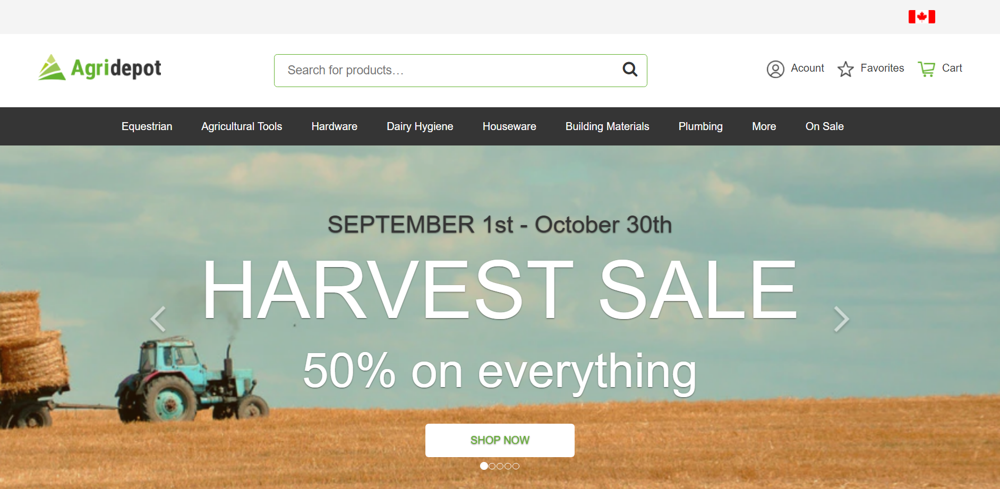

<p align="center">
  <a href="">
    
  </a>
</p>

# Moltin &mdash; React Demo Store

An example store built using [React](https://reactjs.org/), [Redux](https://redux.js.org/) and [moltin](https://moltin.com). This project was bootstrapped with [Create React App](https://github.com/facebookincubator/create-react-app).

* [Demo](https://ilovelamp.now.sh)
* [API Reference](https://docs.moltin.com)

## Development

```bash
git clone https://github.com/topdeveloper2019/Shopify-Reactjs-moltin-.git
cd react-demo-store
yarn # or npm install
yarn start # or npm start
```

Note: You will want to change the `client_id` inside `src/moltin.js` with your own moltin store credentials.

This demo store uses the Redux "[ducks](https://github.com/erikras/ducks-modular-redux)" approach to bundling reducers and actions.

## Deployment

### Heroku

[](https://heroku.com/deploy)

### Docker

1. [Download and install docker](https://docs.docker.com/engine/installation/)
2. Make sure docker is running locally
3. Run `docker build -t lamp .` at command line
4. Run the docker image with the command `docker run -p 5000 IMAGE_ID` where `IMAGE_ID` is the image ID shown in the result of step 3.
5. Access your app on port 5000


